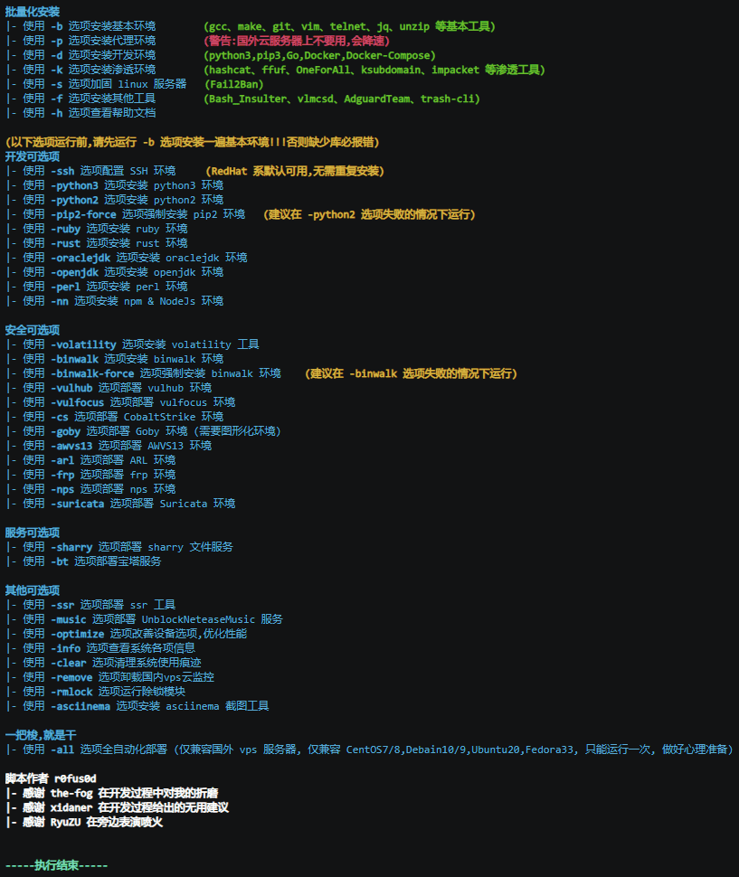

<h1 align="center">
  <br>
  
</h1>

<h4 align="center">Red/Blue team environment automation deployment tool</h4>

<p align="center">
  <a href="#start">Start</a> •
  <a href="#options">Options</a> •
  <a href="#example">Example</a> •
  <a href="#faq">FAQ</a> •
  <a href="#license">License</a>
</p>

<p align="center">
    
    
    </a>
    
</p>

English | [简体中文](README.zh-cn.md)

---

## Start

**Download**

- Visit [releases](https://github.com/ffffffff0x/f8x/releases)

- Download via CF Workers
  - wget : `wget -O f8x https://f8x.io/`
  - curl : `curl -o f8x https://f8x.io/`

**usage**
```bash
bash f8x -h
```

Recommended to add to environment variables
- wget : `wget -O f8x https://f8x.io/ && mv --force f8x /usr/local/bin/f8x && chmod +x /usr/local/bin/f8x`
  - `f8x -h`
- curl : `curl -o f8x https://f8x.io/ && mv --force f8x /usr/local/bin/f8x && chmod +x /usr/local/bin/f8x`
  - `f8x -h`

**System Dependency**

f8x basically doesn't need any dependencies, it is made to help you install various dependencies😁

**f8x-ctf**

This script is used to deploy CTF environments (Web、Misc、Crypto、Pwn、Iot)

- wget : `wget -O f8x-ctf https://f8x.io/ctf`
  - `bash f8x-ctf -help`
- curl : `curl -o f8x-ctf https://f8x.io/ctf`
  - `bash f8x-ctf -help`

**f8x-dev**

Deployment of middleware, database (apache、nginx、tomcat、Database、php)

- wget : `wget -O f8x-dev https://f8x.io/dev`
  - `bash f8x-dev -help`
- curl : `curl -o f8x-dev https://f8x.io/dev`
  - `bash f8x-dev -help`

---

## Options

The following options are currently supported by f8x

**Batch installation**
- `-b`            : install Basic Environment (gcc、make、git、vim、telnet、jq、unzip and other basic tools)
- `-p`            : install Proxy Environment (Warning : Use only when needed)
- `-d`            : install Development Environment (python3、pip3、Go、Docker、Docker-Compose、SDKMAN)
- `-k` (`a`/`b`/`c`/`d`/`e`): install Pentest environment (hashcat、ffuf、OneForAll、ksubdomain、impacket and other Pentest tools)
- `-s`            : install Blue Team Environment (Fail2Ban、chkrootkit、rkhunter、shellpub)
- `-f`            : install Other Tools (AdguardTeam、trash-cli、fzf)
- `-cloud`        : install Cloud Applications (Terraform、Serverless Framework、wrangler)
- `-all`          : fully automated deployment (Compatible with CentOS7/8,Debain10/9,Ubuntu20/18,Fedora33)

**Development Environment**
- `-docker`         : install docker
- `-lua`            : install lua
- `-nn`             : install npm & NodeJs
- `-go`             : install go
- `-oraclejdk(8/11)`: install oraclejdk
- `-openjdk`        : install openjdk
- `-py3(7/8/9/10)`  : install python3
- `-py2`            : install python2
- `-pip2-f`         : force install pip2 (It is recommended to run with the -python2 option failing)
- `-perl`           : install perl
- `-ruby`           : install ruby
- `-rust`           : install rust
- `-code`           : install code-server
- `-chromium`       : install Chromium (Used with rad, crawlergo in the -k option)
- `-phantomjs`      : install PhantomJS

**Blue Team Service**
- `-binwalk`      : install binwalk
- `-binwalk-f`    : force install binwalk (It is recommended to run if the -binwalk option fails)
- `-clamav`       : install ClamAV
- `-lt`           : install LogonTracer (High hardware configuration requirements)
- `-suricata`     : install Suricata
- `-vol`          : install volatility
- `-vol3`         : install volatility3

**Red Team Service**
- `-aircrack`     : install aircrack-ng
- `-bypass`       : install Bypass
- `-goby`         : install Goby (The client side requires a graphical environment, the server side does not.)
- `-yakit`        : install yakit

**Red Team Infrastructure**
- `-awvs14`       : install AWVS14 (~1.04 GB)
- `-cs`           : install CobaltStrike 4.3
- `-cs45`         : install CobaltStrike 4.5
- `-frp`          : install frp
- `-interactsh`   : install interactsh (https://github.com/projectdiscovery/interactsh)
- `-merlin`       : install merlin (https://github.com/Ne0nd0g/merlin)
- `-msf`          : install Metasploit
- `-nps`          : install nps
- `-pupy`         : install pupy (https://github.com/n1nj4sec/pupy)
- `-rg`           : install RedGuard (https://github.com/wikiZ/RedGuard)
- `-sliver`       : install sliver-server && client (https://github.com/BishopFox/sliver)
- `-sliver-client` : install sliver-client
- `-sps`          : install SharPyShell (https://github.com/antonioCoco/SharPyShell)
- `-viper`        : install Viper (~2.1 GB)

**Docker-based environment deployment**
- `-arl`          : install ARL (~872 MB)
- `-mobsf`        : install MobSF (~1.54 GB)
- `-nodejsscan`   : install nodejsscan (~873 MB)
- `-vulhub`       : install vulhub (~210 MB)
- `-vulfocus`     : install vulfocus (~1.04 GB)
- `-TerraformGoat`: install TerraformGoat

**Miscellaneous Services**
- `-asciinema`    : install asciinema
- `-bt`           : install 宝塔服务
- `-clash`        : install clash (https://github.com/juewuy/ShellClash)
- `-music`        : install UnblockNeteaseMusic
- `-nginx`        : install nginx
- `-ssh`          : install ssh (RedHat is available by default, no need to reinstall)
- `-ssr`          : install ssr
- `-zsh`          : install zsh

**Other**
- `-clear`        : Clean up system usage traces
- `-info`         : View system information
- `-optimize`     : Improve device options and optimize performance
- `-remove`       : Uninstall some vps cloud monitoring
- `-rmlock`       : Run the Unlock module
- `-swap`         : Configuring swap partitions
- `-update`       : Update f8x
- `-upgrade`      : Upgrade Pentest tools

---

## Example

**-h View Help**

<h3 align="center">
  </a>
</h3>

**-all Fully automated deployment**

Take vultr vps as an example

| <br><b><p align="center">CentOS 7</p> | <br><b><p align="center">Debian 10</p> |
| - | - |
| <p align="center"><a href="https://asciinema.org/a/WTGNRBd9WYLHUOgZcce9sjkeY"></p></a> | <p align="center"><a href="https://asciinema.org/a/Mq0N07O9K2jWsDuUoukHTEVOt"></p></a> |
| <br><b><p align="center">Fedora 33</p> | <br><b><p align="center">Ubuntu 20.10</p> |
| <p align="center"><a href="https://asciinema.org/a/NccoFLvW5Xcl0PW0HnTu32vHf"></p></a> | <p align="center"><a href="https://asciinema.org/a/Us90ody5ffAOIrr9p93dmO8Ct"></p></a> |

---

## FAQ

**What does the -p option do?**

1. Replace your DNS (default is 223.5.5.5)
2. Check the base compilation environment
3. Download Proxychains-ng, compile and install
4. Modify the /etc/proxychains.conf file
5. Modify the pip proxy to https://mirrors.aliyun.com/pypi/simple/
6. Change the docker proxy to https://docker.mirrors.ustc.edu.cn , and restart the docker service

**Want f8x to run in CI/CD, but not interactive?**

Just create an empty file `IS_CI` in `/tmp`
```bash
touch /tmp/IS_CI
wget -O f8x https://f8x.io/ && mv --force f8x /usr/local/bin/f8x && chmod +x /usr/local/bin/f8x
f8x -k
```

---

## License

[Apache License 2.0](https://github.com/ffffffff0x/f8x/blob/main/LICENSE)

---

# 404StarLink 2.0 - Galaxy


f8x has joined 404Team [404StarLink 2.0 - Galaxy](https://github.com/knownsec/404StarLink2.0-Galaxy)

---

> create by ffffffff0x
